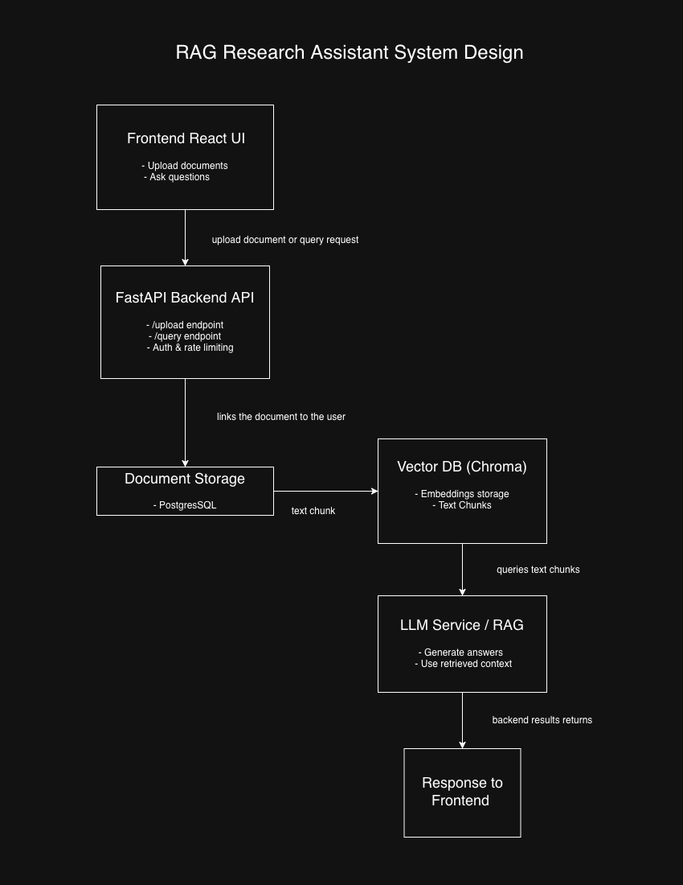

# RAG-Powered Research Assistant

A **Research Assistant web app** that allows users to upload documents, perform semantic searches, and receive AI-generated answers using **Retrieval-Augmented Generation (RAG)** with a **vector database** and LLM. Built with **FastAPI backend** and **React frontend**.

---

## RAG Research Assistant System Design Diagram

---

## Key Features
- Upload and index documents for semantic search
- Generate embeddings for efficient vector-based retrieval
- Perform query-based RAG to return AI-generated answers with source references
- Async backend architecture using FastAPI
- Stores metadata in PostgreSQL, embeddings in Chroma vector database
- Frontend React app to interact with documents and queries

---

## System Architecture
